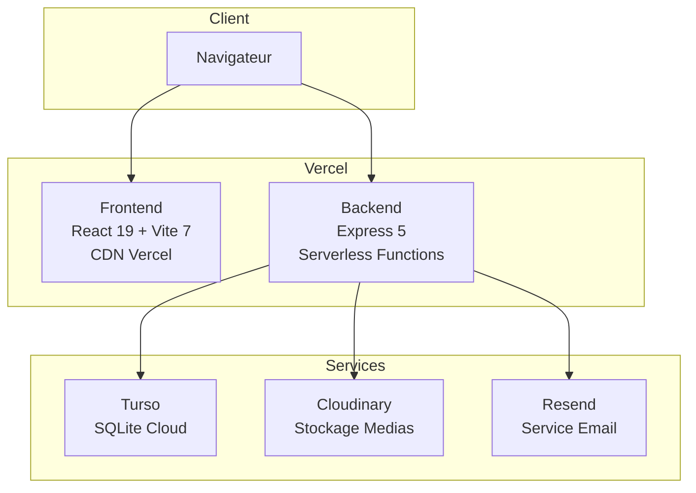
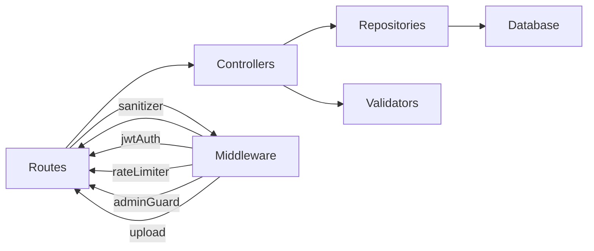
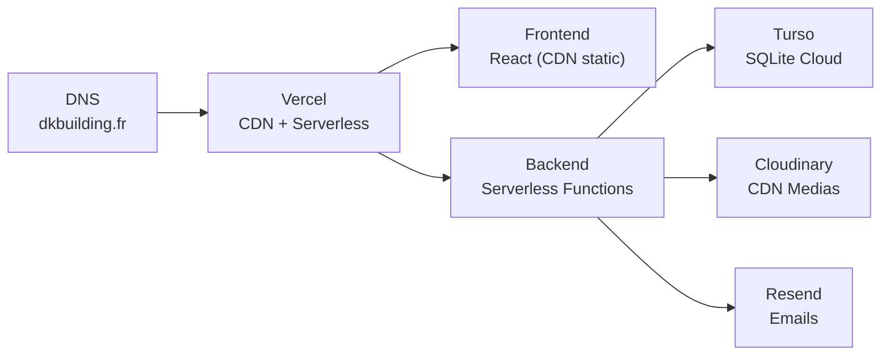

# Site Web DK BUILDING - Documentation technique

## Table des matieres

- [Vue d'ensemble](#vue-densemble)
- [Architecture](#architecture)
- [Frontend](#frontend)
- [Backend](#backend)
- [Base de donnees](#base-de-donnees)
- [Services externes](#services-externes)
- [Securite](#securite)
- [SEO et Performance](#seo-et-performance)
- [Deploiement](#deploiement)

## Vue d'ensemble

Site web pour DK BUILDING, SAS specialisee dans la construction metallique (charpente, bardage, couverture) a Albi, Tarn.

### Informations entreprise

| Champ               | Valeur                              |
|---------------------|-------------------------------------|
| Raison sociale      | DK BUILDING (SAS)                   |
| SIREN               | 947 998 555                         |
| RCS                 | Albi B 947998555                    |
| TVA Intracommunautaire | FR06947998555                    |
| Siege social        | 59 Rue Pierre Cormary, 81000 Albi  |
| Dirigeant           | Dicalou KHAMIDOV                    |
| Creation            | 9 janvier 2023                      |
| Capital social      | 1 000 EUR                           |

## Architecture

### Diagramme general



### Pattern architectural

- **Monorepo pnpm** : `apps/frontend`, `apps/backend`, `apps/shared`, `apps/docs`
- **Backend** : Architecture en couches (Routes > Controllers > Repositories > Database)
- **Frontend** : Composants React avec React Query pour le cache serveur
- **Validation** : Schemas Zod partages entre frontend et backend (`apps/shared/validators/`)

## Frontend

### Stack technique

| Technologie       | Version | Role                                    |
|-------------------|---------|-----------------------------------------|
| React             | 19      | Framework UI                            |
| Vite              | 7       | Build tool et serveur de developpement  |
| TailwindCSS       | 4       | Styling utility-first                   |
| GSAP              | 3       | Animations (ScrollTrigger, timelines)   |
| React Router      | 7       | Routing SPA                             |
| React Query       | 5       | Cache et synchronisation serveur        |
| React Hook Form   | 7       | Gestion des formulaires                 |
| Zod               | 4       | Validation des formulaires              |
| Lucide React      | 0.5+    | Bibliotheque d'icones                   |

### Design

**Palette de couleurs** :

| Nom          | Hex       | Utilisation                          |
|--------------|-----------|--------------------------------------|
| Jaune primaire| `#F3E719` | CTA, accents, hover, logo           |
| Noir profond | `#0E0E0E` | Backgrounds, textes principaux       |
| Blanc        | `#FFFFFF` | Textes sur fond sombre               |

**Typographie** :
- Titres : Space Grotesk
- Corps : Inter

### Animations GSAP

**Tokens d'animation** :

| Token    | Valeur   | Usage                    |
|----------|----------|--------------------------|
| fast     | 0.3s     | Micro-interactions       |
| normal   | 0.6s     | Animations standard      |
| slow     | 0.9s     | Animations complexes     |
| hero     | 1.2s     | Animations hero          |

**Easing par defaut** : `power3.out`

**Accessibilite** : Toutes les animations respectent `prefers-reduced-motion`. Les fallbacks statiques sont fournis quand le mouvement est reduit.

### Sections de la page d'accueil

1. **Hero** : Logo anime, parallax, CTA "Demander un devis gratuit"
2. **Services** : 5 cartes (Charpente, Bardage, Couverture, Photovoltaique, Climatisation)
3. **Portfolio** : Galerie avec lightbox, lazy loading, filtres par type
4. **A propos** : Donnees legales, compteurs animes, valeurs, timeline
5. **Contact** : Formulaire multi-etapes (3 etapes) avec validation temps reel
6. **Footer** : Informations legales, liens rapides, contact, reseaux sociaux

## Backend

### Stack technique

| Technologie        | Version | Role                                 |
|--------------------|---------|--------------------------------------|
| Express            | 5       | Framework HTTP                       |
| Turso (libSQL)     | 0.17+   | Base de donnees SQLite cloud         |
| Cloudinary         | 2.9+    | Stockage et optimisation medias      |
| Resend             | 4.8+    | Service d'envoi d'emails             |
| JWT (jsonwebtoken) | 9       | Authentification (HS512)             |
| Zod                | 4       | Validation des donnees entrantes     |
| Helmet             | 8       | En-tetes de securite HTTP            |
| Multer             | 2       | Parsing multipart (Cloudinary)       |
| express-rate-limit | 8       | Protection contre les abus           |
| Morgan             | 1.10    | Logging HTTP                         |

### Architecture en couches



**Routes** (`routes/`) : Definition des endpoints et chaine de middlewares.

**Controllers** (`controllers/`) : Logique HTTP, orchestration, parsing des reponses. Quatre controllers :
- `adminController` : Statistiques et logs du dashboard
- `annoncesController` : CRUD annonces avec gestion des fichiers Cloudinary
- `projetsController` : CRUD projets avec gestion des fichiers Cloudinary
- `mediaController` : Listing, serving et suppression de medias Cloudinary

**Repositories** (`repositories/`) : Couche d'acces aux donnees. Pattern Repository avec heritage :
- `BaseRepository` : CRUD generique (getAll, getById, getBySlug, create, update, delete, count, incrementViewCount, getAllSlugs)
- `AnnoncesRepository` : Etend BaseRepository avec getPublic, getFiltered, slugExists, createWithReturning, updateWithCoalesce
- `ProjetsRepository` : Etend BaseRepository avec getPublic, getFeatured, getFiltered, slugExists, createWithReturning, updateWithCoalesce

**Middleware** (`middleware/`) :
- `jwtAuth` : Authentification et autorisation JWT (HS512, cookie HttpOnly ou header Bearer)
- `sanitizer` : Nettoyage XSS sur body, query et params
- `rateLimiter` : Trois niveaux (public 100/15min, admin 50/15min, login 5/15min)
- `adminGuard` : Guard multi-couches (rate limit + IP whitelist + JWT + role admin)
- `upload` : Integration Multer/Cloudinary avec optimisation automatique des images

**Validators** (`validators/`) : Schemas Zod pour annonces, projets et formulaire de contact.

**Utils** (`utils/`) :
- `emailService` : Service d'envoi d'emails via Resend avec templates HTML
- `logger` : Logs d'audit persistants en base de donnees (Turso)
- `slugify` : Generation de slugs uniques
- `parseJSON` : Parsing JSON securise pour les colonnes TEXT de SQLite
- `dbInit` : Initialisation de la base et execution des migrations
- `backup` : Creation et gestion des sauvegardes
- `lockAccessConfig` : Gestion de la configuration du systeme LockAccess

## Base de donnees

### Turso (SQLite Cloud)

Base de donnees SQLite hebergee dans le cloud via Turso. Connexion asynchrone via `@libsql/client`.

**Tables** :

| Table        | Description                         |
|--------------|-------------------------------------|
| `annonces`   | Actualites et annonces de l'entreprise |
| `projets`    | Projets realises et en cours        |
| `admin_users`| Comptes administrateurs             |
| `logs`       | Logs d'audit (actions, erreurs)     |

Les migrations SQL sont dans `database/migrations/` et executees automatiquement au premier demarrage.

### Fallback local

Si `TURSO_DATABASE_URL` n'est pas defini, le systeme bascule sur un fichier SQLite local (`file:local.db`). Les operations base de donnees sont alors desactivees en mode degrade.

## Services externes

### Cloudinary

Stockage et distribution des medias (images, documents, videos). Configuration dans le middleware `upload.js`.

- Dossier de base : `dkbuilding/`
- Optimisation automatique : `quality: auto`, `fetch_format: auto`
- Taille max : 50 Mo par fichier
- Formats : jpg, jpeg, png, webp, pdf, doc, docx, mp4, mov

### Resend

Service d'envoi d'emails transactionnels. Deux templates :
1. **contact-form** : Notification au gerant avec les details du devis
2. **confirmation** : Accusé de reception envoye au client

Configuration : cle API (`RESEND_API_KEY`) + domaine verifie dans le dashboard Resend.

### Vercel

Hebergement en mode Serverless Functions. Le backend exporte `module.exports = app` pour compatibilite Vercel.

## Securite

### Couches de protection

1. **Helmet** : CSP strict, HSTS preload, Referrer-Policy strict-origin-when-cross-origin
2. **CORS** : Origines explicitement listees (localhost, dkbuilding.fr, sous-domaines admin)
3. **Rate Limiting** : 3 niveaux de protection par IP
4. **Sanitization XSS** : Nettoyage des entrees (suppression des tags HTML, event handlers, javascript: URLs)
5. **JWT HS512** : Token signe avec secret de 512 bits, verification d'integrite (hash SHA-512)
6. **Cookie HttpOnly** : Token non accessible depuis JavaScript client
7. **Validation Zod** : Schemas stricts sur toutes les donnees entrantes
8. **Admin Guard** : IP whitelisting + rate limit + JWT + role check en production
9. **Timing-safe compare** : Comparaison de mots de passe resistante aux attaques par timing

### Generation des secrets

```bash
cd apps/backend
node generateSecurity.js
```

Genere automatiquement `JWT_SECRET`, `JWT_SALT`, `JWT_VERIFICATION_HASH` et `HEALTH_PASSWORD` dans le fichier `.env`.

## SEO et Performance

### SEO

- Meta tags optimises avec mots-cles locaux (charpente metallique, Albi, Tarn)
- Schema.org LocalBusiness avec donnees completes
- Sitemap.xml et robots.txt
- Open Graph pour les reseaux sociaux
- Canonical URL

### Performance

- Lazy loading des images et composants
- Code splitting avec React Router
- Optimisation automatique des images via Cloudinary (WebP, qualite auto)
- Fonts optimisees avec preconnect
- Score Lighthouse > 90

### Accessibilite

- `prefers-reduced-motion` respecte
- ARIA labels sur la navigation et les formulaires
- Focus management pour la navigation au clavier
- Contraste WCAG AA minimum

## Deploiement

### Architecture de production



### Commandes de deploiement

```bash
# Frontend
cd apps/frontend
pnpm build              # Genere dist/
pnpm build:prerender    # Build + prerendering SEO

# Backend
cd apps/backend
vercel deploy           # Deploiement Vercel
```

### Cout

L'architecture est concue pour fonctionner avec les plans gratuits de tous les services :
- Vercel : plan gratuit (100 Go/mois bande passante)
- Turso : plan gratuit (500 Mo stockage, 9 Mo total rows read/mois)
- Cloudinary : plan gratuit (25 credits/mois)
- Resend : plan gratuit (3000 emails/mois)

---

**Derniere mise a jour** : 5 avril 2026
